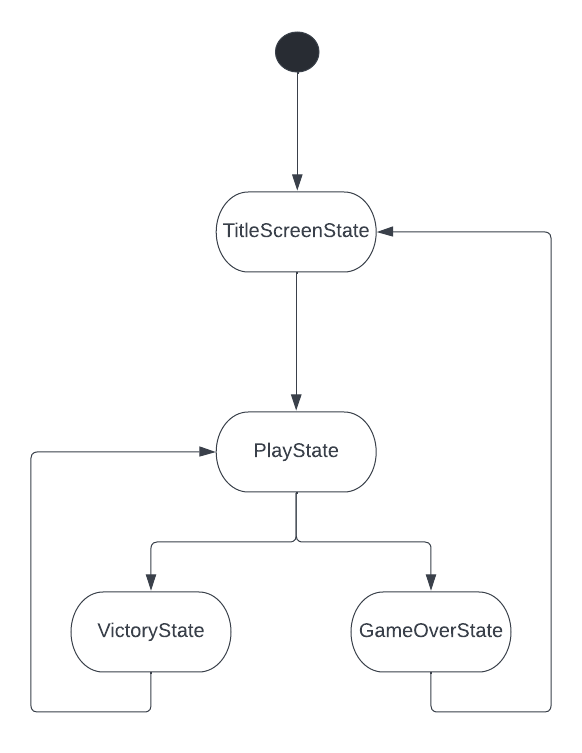
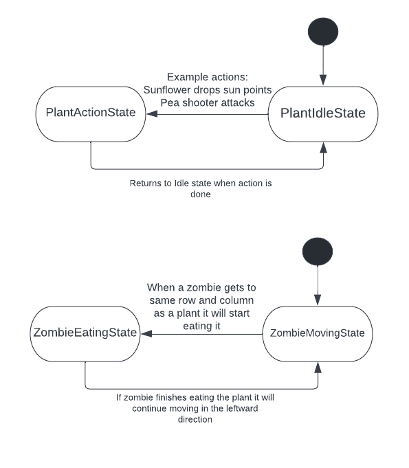
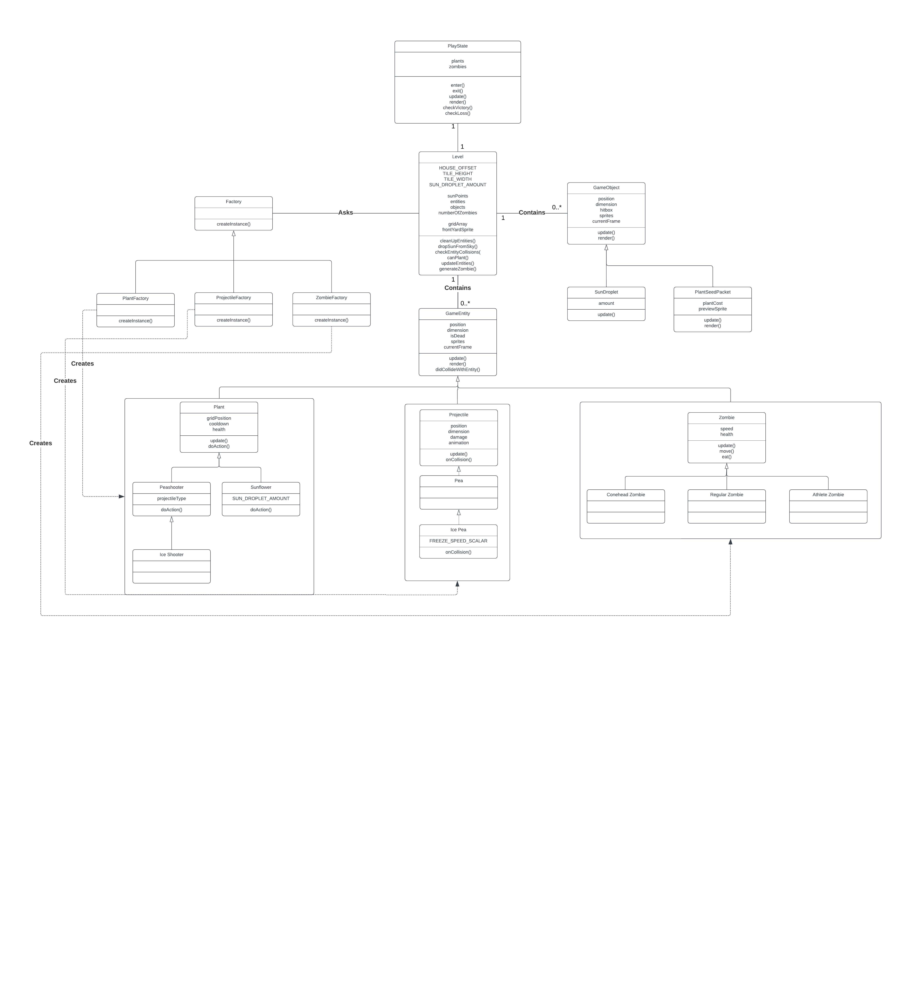
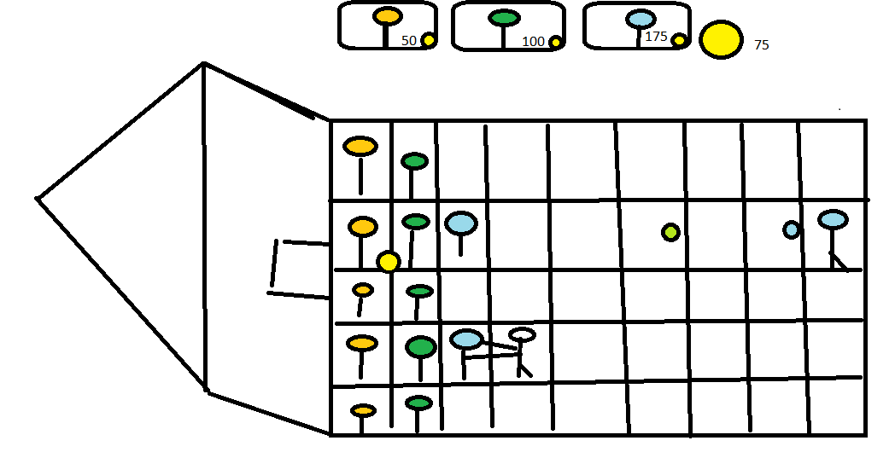

# Game Programming F22 Project - Plants vs. Zombies

## Description
Our game will be a replica of Plants vs. Zombies in Javascript. Our version will be simplified due to time constraints. We will have three types of plants, three types of zombies and three levels. Your task is to defend your front lawn from the onslaught of zombies. Zombified average Joes, conehead workers and athletes are out to eat your brains. You get to choose how you defend your house from the zombies using a combination of sunflower, peashooter and ice peashooter plants. Our game offers replayability by earning stars for limiting how many are used in a given level.

## Gameplay
You are placed in a five by nine grid where you can place a plant on any given tile that does not have a plant already there. To plant plants, you need to have sun points which are attained by droplets from the sky or by planting sunflower plants that generate them at a much faster rate. After a thirty second grace period, zombies start spawning from the right side of the screen and they move in the left direction towards your house. To defend your house, plant peashooters and ice shooters to defeat the zombies. The sun cost for a sunflower is 50, a peashooter is 100 and an ice shooter is 175. Every sun droplet is worth 25 sun. Plants are placed in the grid by dragging them with your mouse. To cancel selection drag and release the mouse click outside of the grid.

The sunflower does not attack any zombies, it simply produces sun droplets. The peashooter shoots peas left to right on the screen to hit the zombies and cause damage. The ice shooter shoots at the same rate as the regular peashooter, however, when its pea hits the zombie, it slows it down for a short period. Multiple ice pea hits on a zombie do not stack, they reset the timer for slowing on every hit.

As for the zombies, the regular zombies do not have any special clothing or equipment and they have the lowest speed and health of all of the zombies. The conehead zombies have a cone on their heads and they have the same speed as the regular zombies but they have the second most health. They start appearing from the second level onward. The last zomby type is the athlete zombie which has the highest health and is faster than the other zombie types. It is recognizable by its headband, and sports gear (it will not vault over a plant like in the real game, we could not find a sprite sheet for the football zombie that actually runs faster). They appear exclusively in the third and final level of the game. When a zombie comes near a plant, they will commence an eating animation, and if they are not defeated in the next five seconds, they will finish eating the plant, it will be removed from play and the zombie will be able to advance.

## Requirements

1. The user should be able to drag and drop plants onto the grid.
2. The user should be able to collect sun droplets that drop from the sky or from their planted sunflowers.
3. The user should have a thirty second grace period to prepare before any zombies come into the game.
4. The user should be able to plant offensive plants such as the peashooter and ice shooter to defend their house.
5. The user should expect the ice shooter to slow down enemies when its pea hits an enemy.
6. The user should not be allowed to plant a given plant if they do not have enough sun points.
7. The user can not remove a plant from a tile.
8. The user should expect only regular zombies in the first level.
9. The user should expect a mix of regular and conehead zombies in the second level.
10. The user should expect a mix of regular, conehead and football zombies in the last level.
11. The user should receive one, two or three stars depending on how many plants they allowed the zombies to eat.
12. The player should expect to win the level when they clear all of the zombies from that level.
13. The player should expect to lose the game if one zombie in any given row makes it to their house.
14. The player should expect that a peashooter and ice shooter can only shoot in the row that they were planted in.
15. The player should expect that a peashooter and ice shooter can only shoot in the right direction and wont shoot zombies behind them.

### State Diagram

### Class Diagram

- The Plant, Zombie, and Projectile objects are instantiated with PlantFactory, ZombieFactory, and ProjectileFactory classes respectively.

### Wireframe

The orange circles are the sunflower plants which produce sun droplets like the one in the second row as the yellow circle. The green circles are the regular peashooters that shoot green peas such as in the second row. In that same row, you can see the ice shooter also shooting its ice pea and causing the zombie to have a light-blue hue because it is frozen and it will go slower. In the fourth row, we see a zombie eating a plant. The top part has the cost for each plant and how many sun points the user has.

### Assets
We used MS Paint to create the wireframes. We plan to attempt to recreate the original Plants vs Zombies’ UI as much as possible, though to a simpler degree.

#### Images

- Images come from [sprites-resource.com](https://www.spriters-resource.com/ds_dsi/pvszds/), with individual links provided below
  - [Peashooter](https://www.spriters-resource.com/ds_dsi/pvszds/sheet/43948/)
  - [Ice Peashooter](https://www.spriters-resource.com/ds_dsi/pvszds/sheet/84687/)
  - [Sunflower](https://www.spriters-resource.com/ds_dsi/pvszds/sheet/43949/)
  - [Sun](https://www.spriters-resource.com/ds_dsi/pvszds/sheet/145666/)
  - [Regular Zombie](https://www.spriters-resource.com/ds_dsi/pvszds/sheet/138563/)
  - [Conehead Zombie](https://www.spriters-resource.com/ds_dsi/pvszds/sheet/138662/)
  - [Athlete Zombie](https://www.spriters-resource.com/ds_dsi/pvszds/sheet/139807/)
  - [Yard](https://www.spriters-resource.com/ds_dsi/pvszds/sheet/116729/)

#### Fonts

- We're going to be using the [Series Orbit](https://www.dafont.com/seriesorbit.font) font, which we find is close to the original Plants vs. Zombies font.
  - For the title screen text, we will use the [Burbank](https://housefonts.com/hi/burbank) and [Monster](https://housefonts.com/hi/monster) fonts for the Plants and Zombies respectively.

#### Sounds

- For the main background music, we’re going to use [Grasswalk](https://www.youtube.com/watch?v=vtAxGidDY7o), the music from Plants vs. Zombies’ Day levels.
- We’re taking sound effects from [sounds-resource.com](https://www.sounds-resource.com/pc_computer/plantsvszombies/sound/1430/)
